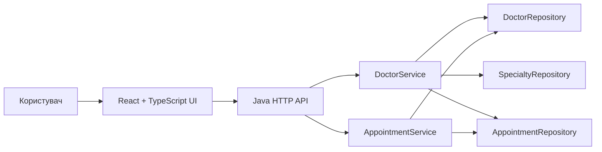
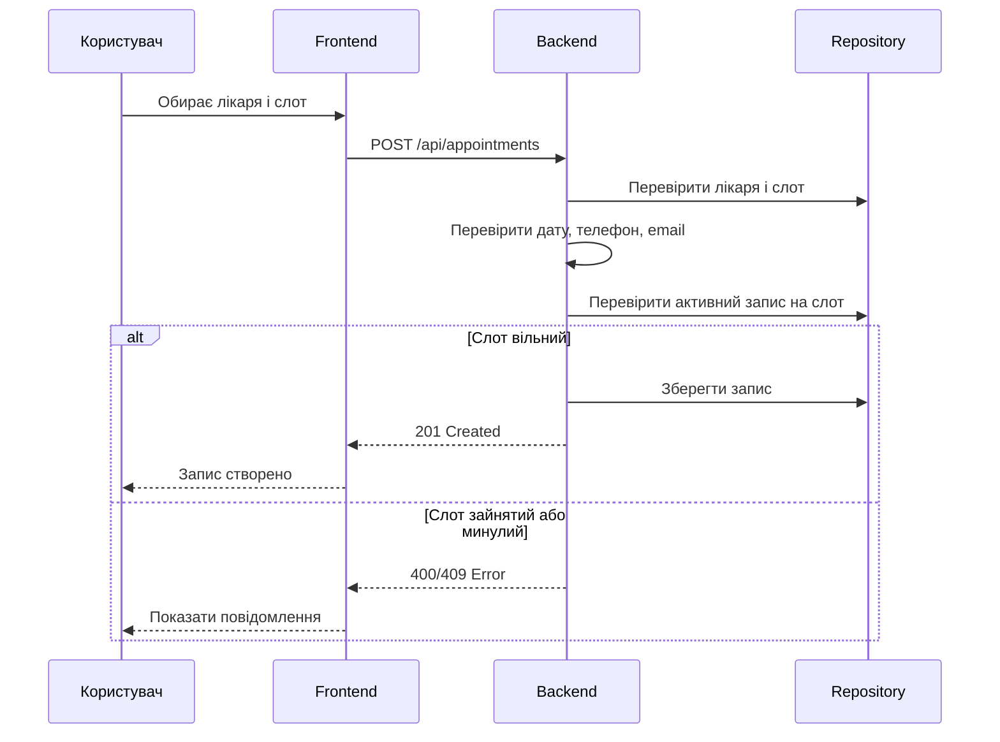

# МедНавігатор

Backend + frontend для агрегатора медичних послуг: пошук лікарів за спеціалізацією, фільтрація за параметрами та онлайн-запис на прийом.


## Про Проєкт

**МедНавігатор** - навчальний вебзастосунок для швидкого пошуку лікаря та бронювання зручного часу прийому. Система складається з Java backend API та сучасного React + TypeScript frontend.

Основна ідея проста: користувач спочатку знаходить лікаря за спеціалізацією, містом, датою, рейтингом, ціною або стажем, а вже після вибору конкретного лікаря відкриває вікно запису та обирає доступний слот.

## Можливості

- Пошук лікарів за спеціалізацією, містом і текстовим запитом.
- Фільтрація за датою, мінімальним рейтингом, максимальною ціною та стажем.
- Сортування за рейтингом, ціною, досвідом або найближчим доступним часом.
- Перегляд доступних часових слотів конкретного лікаря.
- Онлайн-запис пацієнта з валідацією телефону та email.
- Захист від подвійного бронювання одного слота.
- Заборона запису на минулий час.
- Перевірка записів за номером телефону.
- Скасування активного запису.
- Адаптивний UI для desktop, tablet і mobile.
- Світла та темна тема інтерфейсу.
- Україномовний інтерфейс.

## Технології

### Backend

- Java 8+
- `com.sun.net.httpserver.HttpServer`
- REST-like HTTP API
- JSON-відповіді
- In-memory repositories
- Сервісний шар для бізнес-логіки
- Просте тестування без зовнішніх фреймворків

### Frontend

- React 19
- TypeScript
- Vite
- lucide-react
- CSS з адаптивною версткою
- Fetch API для взаємодії з backend

## Архітектура



Backend розділено на кілька шарів:

- `domain` - основні сутності: лікар, спеціальність, слот, запис.
- `dto` - об'єкти запитів і критерії пошуку.
- `repository` - зберігання даних у пам'яті.
- `service` - бізнес-логіка пошуку, бронювання та скасування.
- `web` - HTTP-маршрути, JSON-відповіді та CORS.
- `util` - допоміжні класи для дат, рядків і JSON.

Frontend розділено на компоненти:

- `components/doctors` - список лікарів і форма запису.
- `components/filters` - панель фільтрів.
- `components/appointments` - перевірка та скасування записів.
- `components/layout` - верхня частина інтерфейсу та перемикач теми.
- `components/feedback` - повідомлення про успіх або помилки.
- `hooks` - логіка теми.
- `utils` - форматування дат, часу та допоміжні функції.

## Структура

```text
.
├── frontend/
│   ├── src/
│   │   ├── components/
│   │   ├── hooks/
│   │   ├── utils/
│   │   ├── App.tsx
│   │   ├── api.ts
│   │   ├── main.tsx
│   │   ├── styles.css
│   │   └── types.ts
│   ├── index.html
│   ├── package.json
│   ├── tsconfig.json
│   └── vite.config.ts
├── src/
│   ├── main/java/ua/edu/duit/medical/
│   │   ├── config/
│   │   ├── domain/
│   │   ├── dto/
│   │   ├── exception/
│   │   ├── repository/
│   │   ├── service/
│   │   ├── util/
│   │   ├── web/
│   │   └── Application.java
│   └── test/java/ua/edu/duit/medical/
└── LICENSE
```

## API

| Метод | Маршрут | Опис |
|---|---|---|
| `GET` | `/health` | Перевірка стану backend |
| `GET` | `/api/specialties` | Список спеціалізацій |
| `GET` | `/api/doctors` | Пошук лікарів за фільтрами |
| `GET` | `/api/doctors/{id}` | Дані конкретного лікаря |
| `GET` | `/api/doctors/{id}/slots?date=YYYY-MM-DD` | Вільні слоти лікаря |
| `POST` | `/api/appointments` | Створення запису |
| `GET` | `/api/appointments?phone=...` | Пошук записів за телефоном |
| `DELETE` | `/api/appointments/{id}` | Скасування запису |

### Приклад запиту на пошук лікарів

```http
GET /api/doctors?specialty=cardiology&city=Київ&date=2026-05-18&minRating=4.5&sort=ratingDesc
```

### Приклад створення запису

```json
{
  "doctorId": "doc-1",
  "slotId": "slot-1",
  "patientName": "Іван Петренко",
  "phone": "+380501112233",
  "email": "ivan@example.com",
  "notes": "Перший візит"
}
```

## Запуск

### Вимоги

- JDK 8 або новіший
- Node.js та npm

### 1. Клонування

```bash
git clone https://github.com/vladyslav-masokha/java_kurswork.git
cd java_kurswork
```

### 2. Запуск backend

PowerShell:

```powershell
New-Item -ItemType Directory -Force target/classes
$mainSources = Get-ChildItem -Path src/main/java -Recurse -Filter *.java | ForEach-Object { $_.FullName }
javac -encoding UTF-8 -d target/classes $mainSources
java -cp target/classes ua.edu.duit.medical.Application 8080
```

Backend буде доступний за адресою:

```text
http://localhost:8080
```

### 3. Запуск frontend

В іншому терміналі:

```bash
cd frontend
npm install
npm run dev
```

Frontend буде доступний за адресою:

```text
http://127.0.0.1:5173
```

## Тестування

### Backend tests

PowerShell:

```powershell
New-Item -ItemType Directory -Force target/classes
$mainSources = Get-ChildItem -Path src/main/java -Recurse -Filter *.java | ForEach-Object { $_.FullName }
javac -encoding UTF-8 -d target/classes $mainSources

New-Item -ItemType Directory -Force target/test-classes
$testSources = Get-ChildItem -Path src/test/java -Recurse -Filter *.java | ForEach-Object { $_.FullName }
javac -encoding UTF-8 -cp target/classes -d target/test-classes $testSources

java -cp "target/classes;target/test-classes" ua.edu.duit.medical.MedicalServiceTests
```

Очікуваний результат:

```text
All service tests passed.
```

### Frontend build

```bash
cd frontend
npm run build
```

## Ключові Бізнес-Правила



Основні правила:

- слот має існувати у розкладі обраного лікаря;
- слот не може бути в минулому;
- на один слот не може бути двох активних записів;
- телефон є обов'язковим і має містити 10-16 цифр;
- email, якщо вказаний, має містити `@`;
- після створення або скасування запису frontend оновлює список лікарів і кількість доступних слотів.

## Автор

**Vladyslav Masokha**

GitHub: [@vladyslav-masokha](https://github.com/vladyslav-masokha)

## Ліцензія

Проєкт поширюється за ліцензією MIT. Деталі див. у файлі [LICENSE](LICENSE).
